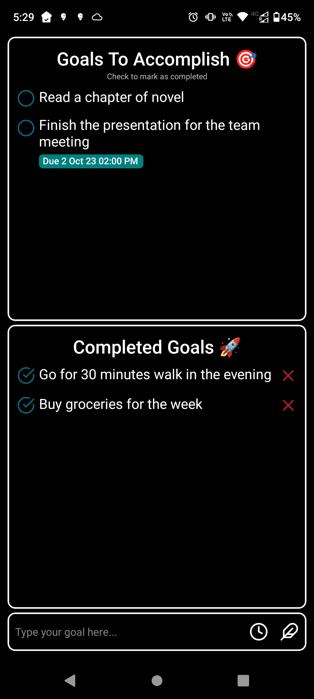

# Daily Goals App

The Daily Goals App is a simple application designed to help you set and track your daily goals. With this app, you can easily define your goals for the day, mark them as completed, and remove them once you're done. It provides a convenient way to stay organized and motivated to achieve your objectives.

## Features

- **Goal Setting**: You can set your daily goals by entering a description for each goal. The app allows you to create multiple goals for a single day, ensuring you can plan and prioritize your tasks effectively.

- **Goal Notifications**: Set a date and time for your goals, and the app will send notifications to remind you of your upcoming tasks. Never miss an important goal again with this handy reminder feature.

- **Goal Reordering**: Arrange your goals in the order of your preference. The app allows you to drag and drop goals to reorder them, ensuring that you can prioritize and organize your tasks exactly the way you want.

- **Goal Completion**: Once you've completed a goal, you can mark it as done within the app. This feature enables you to track your progress throughout the day and visualize your accomplishments.

- **Goal Removal**: After marking a goal as completed, you have the ability to remove it from your list of completed goals. This functionality ensures that your list stays clutter-free and focused on your ongoing and upcoming tasks.

## Dependencies

The Daily Goals App relies on the following dependencies:

- React Native: A framework for building native mobile applications using JavaScript and React.
- Other dependencies: Check the `package.json` file for a complete list.

These dependencies are managed using yarn, the Node.js package manager.

## How to Use

### Installation

1. Download the APK file for the Daily Goals App from the [Output](./output) folder in this repository.

2. Transfer the APK file to your Android device if you downloaded it on your computer.

3. On your Android device, navigate to the folder where you saved the APK file and tap on it to begin the installation process.

4. If prompted, you may need to enable installation from "Unknown Sources" in your device's settings. This step ensures that you can install apps from sources other than the Google Play Store.

5. Follow the on-screen instructions to complete the installation.

### Usage

1. Launch the Daily Goals App from your device's app drawer.

2. Upon opening the app, you'll be presented with a simple interface to start setting your daily goals.

3. To create a new goal, tap the "Add Goal" button and enter a description for your goal.

4. Optionally, you can set a date and time for the goal to receive notifications.

5. After completing a goal, mark it as done by tapping the checkbox or the "Mark as Done" button.

6. To remove completed goals from your list, tap the "Remove Completed Goals" button.

7. Stay organized, track your progress, and achieve your daily objectives with the Daily Goals App!

## Contributing

Contributions to the Daily Goals App are welcome! If you find any issues or have ideas for enhancements, please submit an issue or pull request to the GitHub repository.

## License

This project is licensed under the [MIT License](LICENSE). Feel free to modify and distribute the code as per the terms of the license.

## Acknowledgements

The Daily Goals App is inspired by the need to organize daily tasks effectively and enhance productivity.